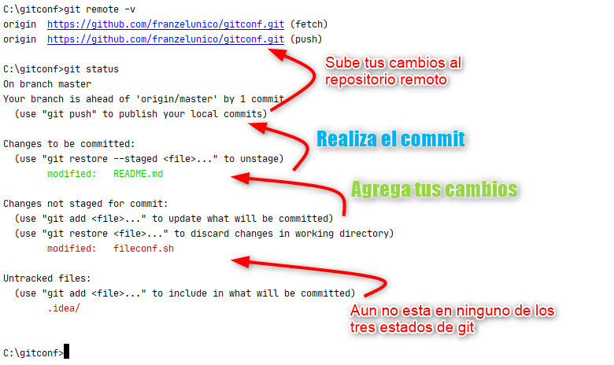

Comando basicos Git
===================

Es un software de control de versiones diseñado por Linus Torvalds, pensando en la eficiencia y la confiabilidad del mantenimiento de versiones que sirve para el seguimiento del desarrolo del codigo en versiones.

## Instalacion y configuraciones:

Se tiene instalado git en la maquina local

```
  # apt-get install git 
  # apt-get install git-doc
```
Se tiene configurado el nombre y el email en git.

```
  $ git config --global user.name "Franz Lopez F.A.L"
  $ git config --global user.email "franzelunico@gmail.com"
  $ git config --help #para mas informacion
```
Git puede producir resultados inesperados en los saltos de linea si en el equipo de trabajo usan diferentes S.O, (Windows, Mac OS, GNU/Linux).

Para no tener este problema se debe configurar **autocrlf**

Cuando nos traigamos los archivos desde el repositorio remoto, Git convertirá todos los cambios de salto de línea al del S.O y al subir los cambios lo convertira LF.

| S.O  | Caracteres de salto de Linea  | autocrlf  | Git usara |
|---|---|---|---|             
| Windows   |  CR  LF | true  | LF |
| Mac OS X  |      LF | input | LF |
| Gnu/Linux |      LF | input | LF |

Si usas Windows aplica:
```
git config --global core.autocrlf true
```

Si usas Mac OS X o GNU/Linux aplica:
```
git config --global core.autocrlf input
```

Otro aspecto importante es la codificación de caracteres lo recomendable es que todos los archivos usen la misma codificacion UTF-8, otra alternativa es Unicode, si no se usa una misma codificacion habran problemas.

## Shortcuts

Configuracion de los shortcuts para:
  * commit -> ci
```
  $ git config --global alias.ci commit
```
  * checkout -> co
```
  $ git config --global alias.co checkout
```
  * status -> st
```
  $ git config --global alias.st status
```

## Los Tres Estados

Git tiene tres estados principales en los que se pueden encontrar tus **archivos rasteados**:

Confirmado (**committed**) significa que los datos están almacenados de manera segura en tu base de datos local que usa git.

Preparado (**staged**) significa que has marcado un archivo modificado en su versión actual para que vaya en tu próxima confirmación.

Modificado (**modified**) significa que has modificado el archivo pero todavía no lo has confirmado en la base de datos de git.

Ejemplo (imagen)




Si tu archivo o archivos no estan ratreados te lo mostrara en la seccion de **Untracked files:** junto al comando para que se puedan rastrear.


## Comandos Basicos:

**add:** si el archivo es nuevo lo pasara a ser rastreado por git, si el archivo no es nuevo y fue modificado lo subira a area al estado **staged**

```
  $ git add [nombre del archivo]
```
**commit:** permite hacer un commit al repositorio

```
  $ git commit -m "texto descriptivo del commit"
```

**checkout:** Reemplaza los cambios en tu directorio de trabajo con el último contenido de HEAD, Los cambios que ya han sido agregados al Index, así como también los nuevos archivos, se mantendrán sin cambio.

```
  $ git checkout [commit] [file]
  $ git checkout master
```

```
  $ git checkout -b [nombre branch]
```
**merge:** verficar los cambios antes de realizar el commit

```
  $ git merge origin/desarrollo_20190212 --no-commit --no-ff
```

**merge branch:** Traemos los cambios de la rama dev a nuestra rama nuevaCaracteristica.
```
  (ramaActual)$ git merge [nombre branch con el cual fusionar]
  (nuevaCaracteristica)$ git merge dev
```


**rm:** elimina uno o vario archivos 

```
  $ git rm [nombre del archivo]
  $ git rm -r -f [nombre del directorio]
```

**mv:** Mover o renombrar un archivo o directorio

```
  $ git mv [ruta archivo] [ruta destino]
```

**reset soft:** Si queremos eliminar los cambios de Git, pero mantener las modificaciones locales del código. Es útil cuando accidentalmente ha preparado algunos archivos que no pertenecían a la confirmación. Después de reiniciar, puede realizar los cambios necesarios y confirmarlos.  Es útil cuando accidentalmente ha preparado algunos archivos que no pertenecían a la confirmación. Después de reiniciar, puede realizar los cambios necesarios y confirmarlos. Este comando debe usarse antes de sincronizarse con el repositorio remoto (pull, push, etc) para evitar problemas.

```
  $ git reset --soft HEAD~1
```

## Git Workflow

Existen diversas formas manejar git dentro de los equipos, la siguiente lista es solo una de ellas.

1. **git status** Asegúrate de que tu área actual esté limpia.
2. **git pull** Obtén la última versión desde el control remoto. Esto ahorra problemas de fusión(merge) más tarde.
3. **Edita tus archivos y haz tus cambios.** ¡Recuerda correr tu linter y hacer pruebas unitarias!
4. **git status** Encuentra todos los archivos que se cambian. ¡Asegúrate de ver los archivos sin seguimiento también!
5. **git add [files]** Agregue los archivos modificados al área de preparación (staging area).
6. **git commit -m "message"** Haz tu nuevo commit.
7. **git push origin [branch-name]** Empuje sus cambios hasta el repositorio remoto.
